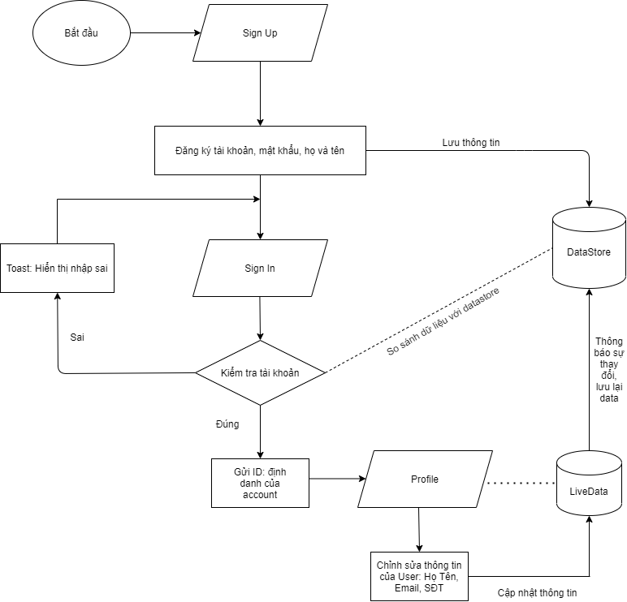
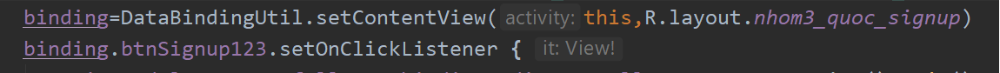
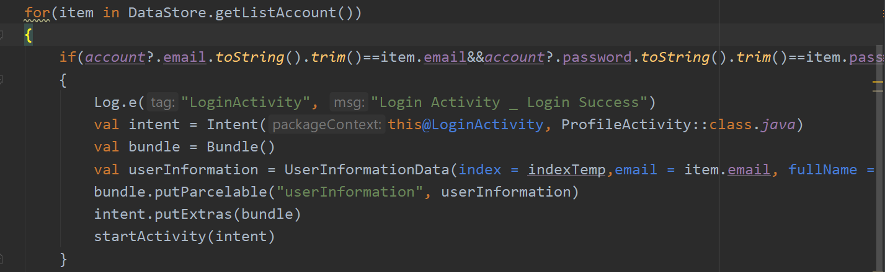
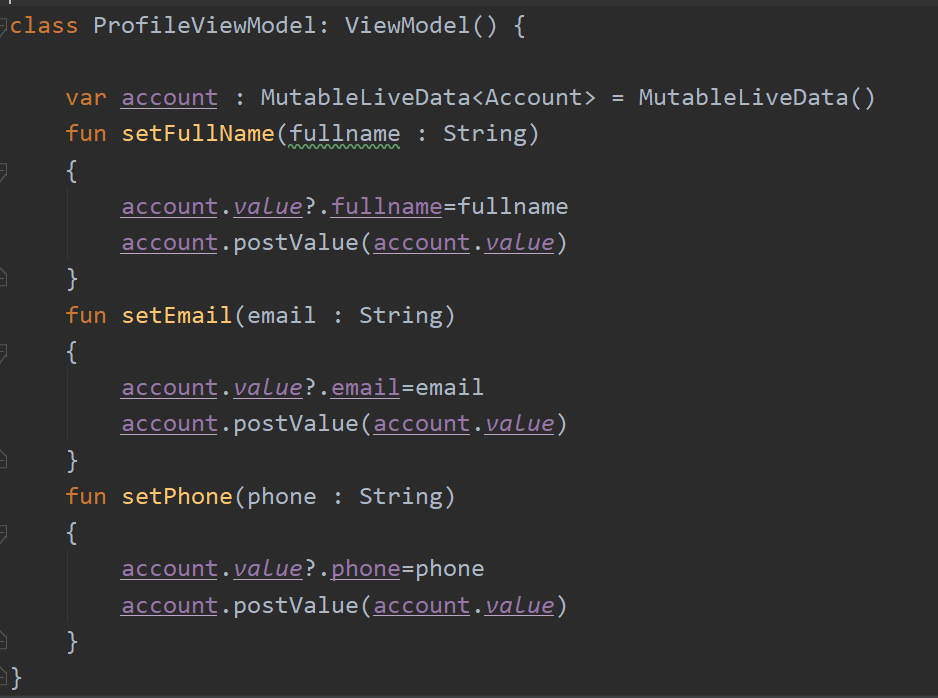
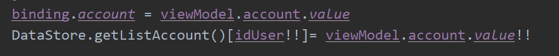

# flowapp

# SignUp
### Áp dụng databinding

# Login 
### check user và password có tồn tại trong DataStore không, nếu có thì chuyển đến trang profile

# Profile
### Áp dụng livedata

<<<<<<< HEAD
=======

###Login_Dat_DataBinding_ViewModel_LiveData
#### 1. Khai bao Databinding, ViewModel

#### 2. Lay Email va Password, giu Email va Password thong qua ViewModel

#### 3. Kiem tra Email va Password, Dang nhap thanh cong se chuyen sang ProfileActivity

#### 4. Dang nhap that bai se hien thi thong bao len man hinh

>>>>>>> ff9e72ddc559e9e4a05dec1dcccbf65b7d39b7ee
