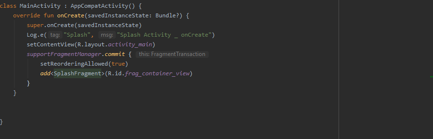
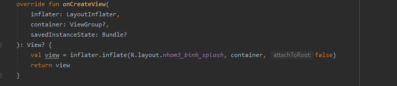
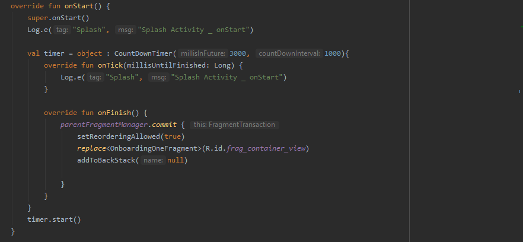
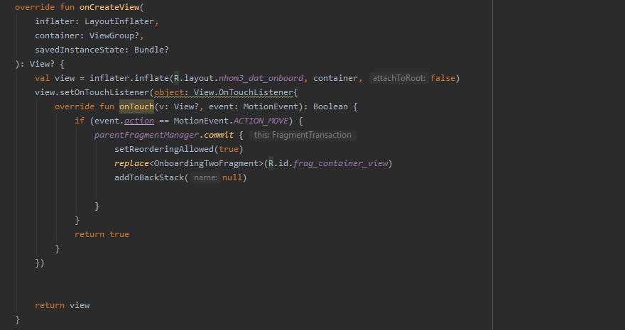
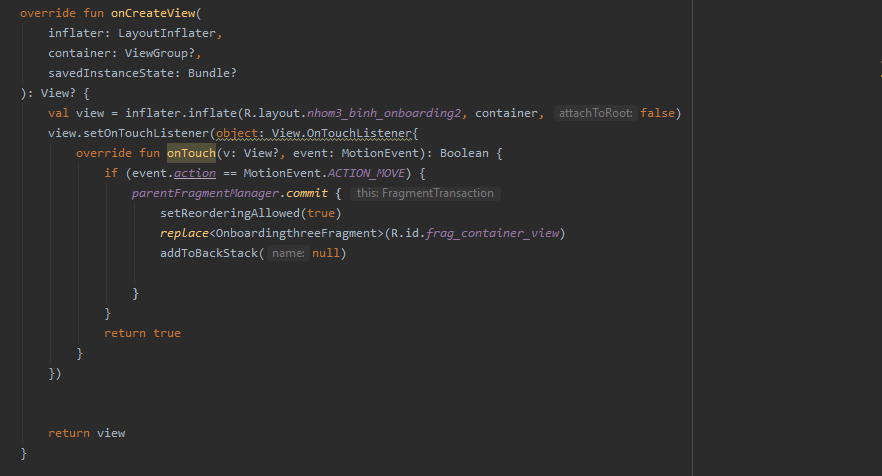
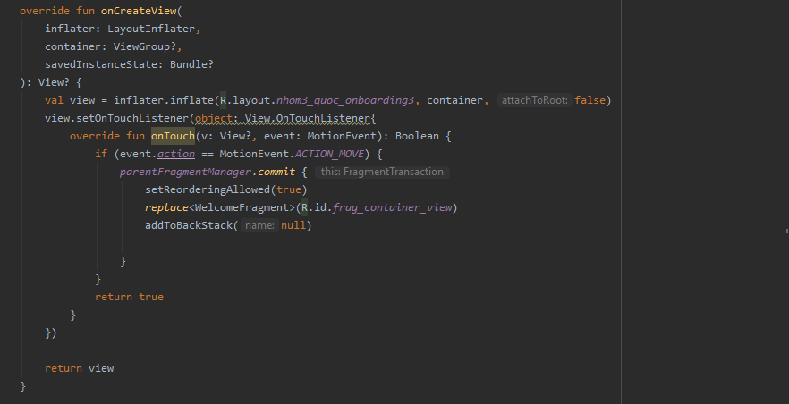

# Báo cáo tuần 5  
## Video Báo Cáo Demo Bài Tập Về Nhà Tuần 

- Link video: https://youtu.be/8y_VV4ZlBns

## Quá Trình Thực Hiện

### Dat_FLOWAPP_Splash_Onboarding1_Onboadriding2_Onboarding3_Welcome

#### 1. MainActivity - Host Activity

 

#### 2. Splash Fragment - Host Fragment - Có Child Fragment là Onboarding1 Fragment

 

 

#### 3. Onboarding1 Fragment - Child Fragment - Sẽ chuyển sang Onboarding2 khi người dùng chạm vào màn hình

#### 4. Onboarding2 Fragment - Child Fragment - Sẽ chuyển sang Onboarding3 khi người dùng chạm vào màn hình

#### 5. Onboarding3 Fragment - Child Fragment - Sẽ chuyển sang Welcome khi người dùng chạm vào màn hình

#### 6. Welcome Fragment - Child Fragment - Sẽ chuyển sang LoginFragment khi người dùng nhấn vào nút Signin

#### 7. LoginFragment - Child Fragment - Sẽ chuyển sang ListRestaurant khi người dùng nhấn vào nút Login và chuyển qua SignUpFragment (khi chưa có tài khoản) nếu nhấn nút Signup

#### 8. SignUpFragment - Child Fragment - Sẽ chuyển sang LoginFragment khi người dùng nhấn vào nút Sign Up hoặc login

 

